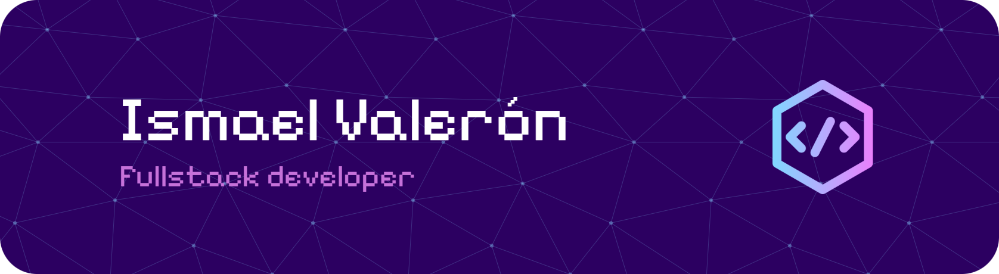

<h1 align="center"><b>Hi , I'm Ismael </b></h1>

## Fullstack Developer 💻

---

### About Me

I am a dedicated fullstack developer focused on writing clean, efficient code and continuous learning. I specialize in building scalable and maintainable applications using modern technologies. 🚀

  

  

### &nbsp;🛠 &nbsp;Tech Stack

&nbsp;
&nbsp;
&nbsp;
&nbsp;
&nbsp;

### ⚙️ &nbsp;GitHub Analytics

### 🤝🏻 &nbsp;Connect with Me

-----
